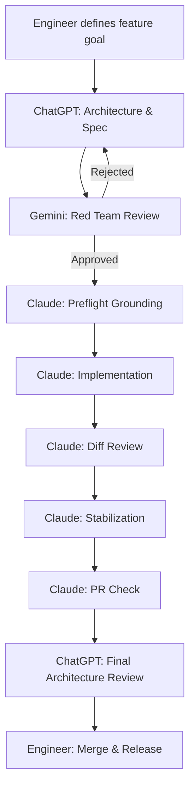

# AI Engineering Workflow

A reusable, multi-agent AI engineering system for real software development.

This repository provides the structure, tooling, documentation, and command templates needed to orchestrate multiple AI agents — ChatGPT, Gemini, and Claude — in a disciplined, staged software development workflow.

---

## What Is the AI Engineering Workflow?

The AI Engineering Workflow is a **structured system for using AI agents to develop software at scale**.

It is not a single AI prompt. It is an operating system for AI-assisted engineering:

- Each AI agent has a defined role.
- Every feature goes through a structured lifecycle.
- Agents share context through a curated **AI Brain** — a set of living documents that describe your project.
- A CLI bootstrap tool (`ai-run.sh`) assembles and exports context bundles for each agent.

---

## Why Multi-Agent Development?

Single-agent workflows hit a wall because:

- One AI cannot hold both the design and execution context reliably.
- Scope creep and hallucination increase when a single agent owns everything.
- There is no adversarial review loop — the same agent that designs also implements.

Multi-agent workflows solve this by separating concerns:

| Agent    | Role                        | Strength                                |
|----------|-----------------------------|-----------------------------------------|
| ChatGPT  | Architect / Planner         | Long-context reasoning, design thinking |
| Gemini   | Red Team Reviewer           | Challenging assumptions, risk detection |
| Claude   | Repository Executor         | Grounded implementation, diff safety    |

---

## Workflow Pipeline



---

## Agent Roles

### ChatGPT — Architect
- Defines feature scope and acceptance criteria
- Creates the spec and implementation plan
- Performs final architectural review before merge

### Gemini — Gatekeeper
- Reviews spec and plan before implementation
- Detects scope violations, dependency risks, invariant breaks
- Must approve before Claude executes

### Claude — Executor
- Runs preflight grounding against the actual repository
- Implements only the approved spec
- Reviews its own diff and stabilizes failures

See [`docs/AI_AGENT_ROLES.md`](docs/AI_AGENT_ROLES.md) for full details.

---

## AI Brain Concept

The **AI Brain** is a set of curated project documents that give AI agents enough context to reason safely about the codebase without scanning all source files.

Key files:

| File | Purpose |
|------|---------|
| `docs/AI_REPO_BRAIN.md` | Architecture overview, module map, invariants |
| `docs/AI_PROJECT_CONTEXT.md` | Product purpose, team context |
| `docs/AI_WORKFLOW.md` | Process rules for this repo |
| `ROADMAP.md` | Canonical feature roadmap |
| `CURRENT_STAGE.md` | Active execution state |
| `KNOWN_ISSUES.md` | Deferred risks and open issues |
| `TEST_REPORT.md` | Latest test verification state |

See [`docs/AI_BRAIN.md`](docs/AI_BRAIN.md) for the full AI Brain architecture.

---

## CLI Bootstrap

The `ai-run.sh` script assembles context bundles for each AI agent.

```bash
# Export context for ChatGPT (architecture + design)
./scripts/ai-run.sh --chatgpt

# Export context for Gemini (review)
./scripts/ai-run.sh --gemini

# Load context into Claude (grounding)
./scripts/ai-run.sh --claude

# Run Claude workflow steps
./scripts/ai-run.sh --claude-preflight
./scripts/ai-run.sh --claude-implement
./scripts/ai-run.sh --claude-diff-review
./scripts/ai-run.sh --claude-stabilize
./scripts/ai-run.sh --claude-pr-check

# Run the full Claude pipeline in one shot
./scripts/ai-run.sh --claude-all
```

---

## Repository Structure

```
.
├── README.md
├── ROADMAP.md                        # Canonical roadmap
├── CURRENT_STAGE.md                  # Active stage execution state
├── KNOWN_ISSUES.md                   # Open risks and deferred items
├── TEST_REPORT.md                    # Latest test state
│
├── docs/
│   ├── AI_ENGINEERING_SYSTEM.md      # Full system architecture
│   ├── AI_WORKFLOW.md                # Feature lifecycle rules
│   ├── AI_BRAIN.md                   # AI context system
│   ├── AI_AGENT_ROLES.md             # Agent responsibilities
│   └── DIAGRAMS.md                   # Mermaid architecture diagrams
│
├── .ai/
│   ├── commands/
│   │   ├── 01_plan_feature.md        # ChatGPT: generate spec + plan
│   │   ├── 02_implement_feature.md   # Claude: implement approved plan
│   │   ├── 03_stabilize_feature.md   # Claude: fix failures
│   │   ├── 04_pr_check.md            # Claude: PR scope audit
│   │   ├── 05_preflight_grounding.md # Claude: ground against real repo
│   │   └── 06_diff_review.md         # Claude: review diff safety
│   │
│   └── templates/
│       ├── spec_template.md
│       ├── plan_template.md
│       ├── stabilize_template.md
│       ├── diff_review_template.md
│       └── preflight_template.md
│
├── scripts/
│   └── ai-run.sh                     # CLI context bundle tool
│
└── examples/
    ├── sample_spec.md
    ├── sample_plan.md
    ├── sample_current_stage.md
    └── sample_test_report.md
```

---

## Example Feature Lifecycle

1. **Engineer** writes a one-paragraph feature goal.
2. **ChatGPT** produces a spec and implementation plan using `01_plan_feature.md`.
3. **Gemini** reviews the spec/plan for risks using the red team prompt.
4. **Claude** runs preflight grounding (`05_preflight_grounding.md`) against the real repo.
5. **Claude** implements the feature (`02_implement_feature.md`) within approved scope.
6. **Claude** reviews its own diff (`06_diff_review.md`) for safety violations.
7. **Claude** stabilizes any failures (`03_stabilize_feature.md`).
8. **Claude** runs a PR scope check (`04_pr_check.md`).
9. **ChatGPT** performs final architectural review.
10. **Engineer** merges and updates `ROADMAP.md`.

---

## How to Adopt This System

1. Copy this repository structure into your project (or use it as a template).
2. Populate the AI Brain files for your project:
   - `docs/AI_REPO_BRAIN.md` — describe your architecture
   - `ROADMAP.md` — list your planned stages
   - `CURRENT_STAGE.md` — set the active stage
3. Customize the command templates in `.ai/commands/` to match your tech stack.
4. Set up `ai-run.sh` for your project root.
5. Start your first feature cycle using `01_plan_feature.md`.

---

## License

MIT
