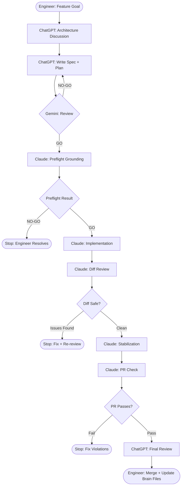
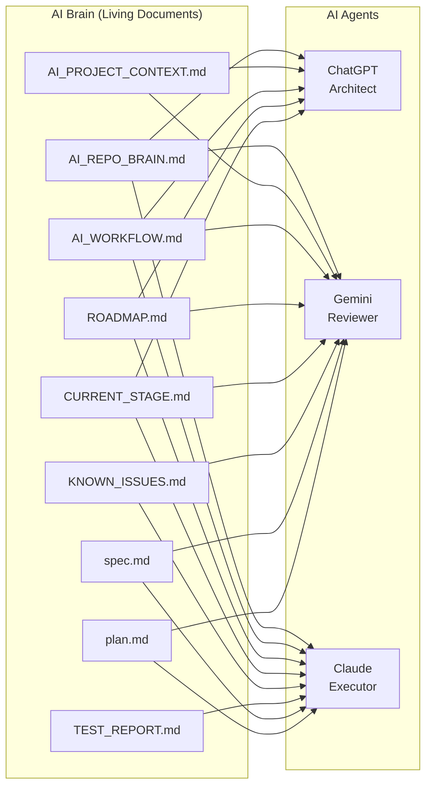
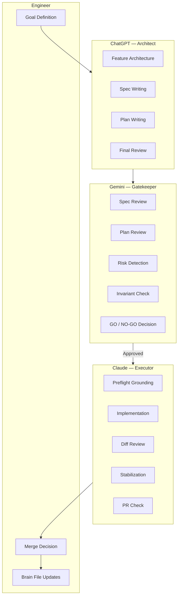
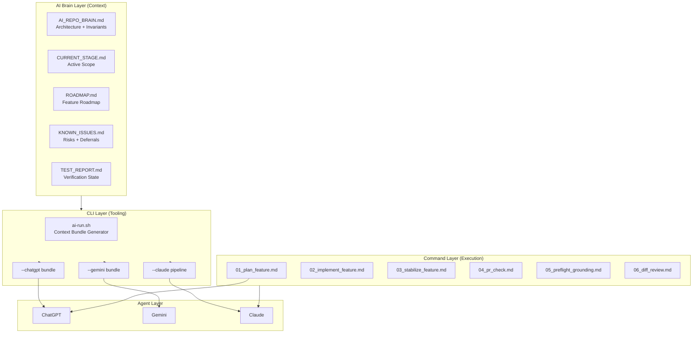
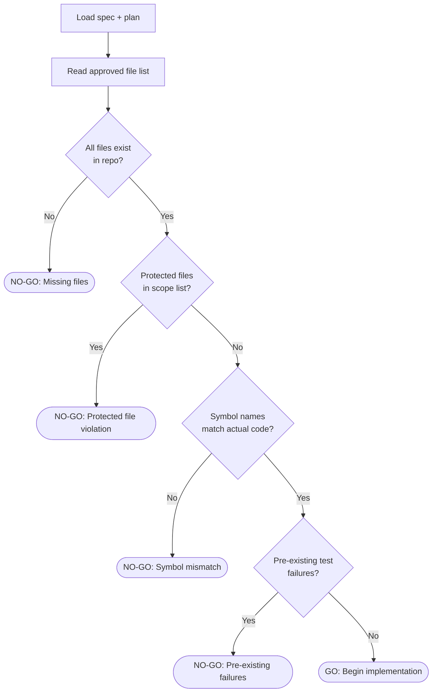
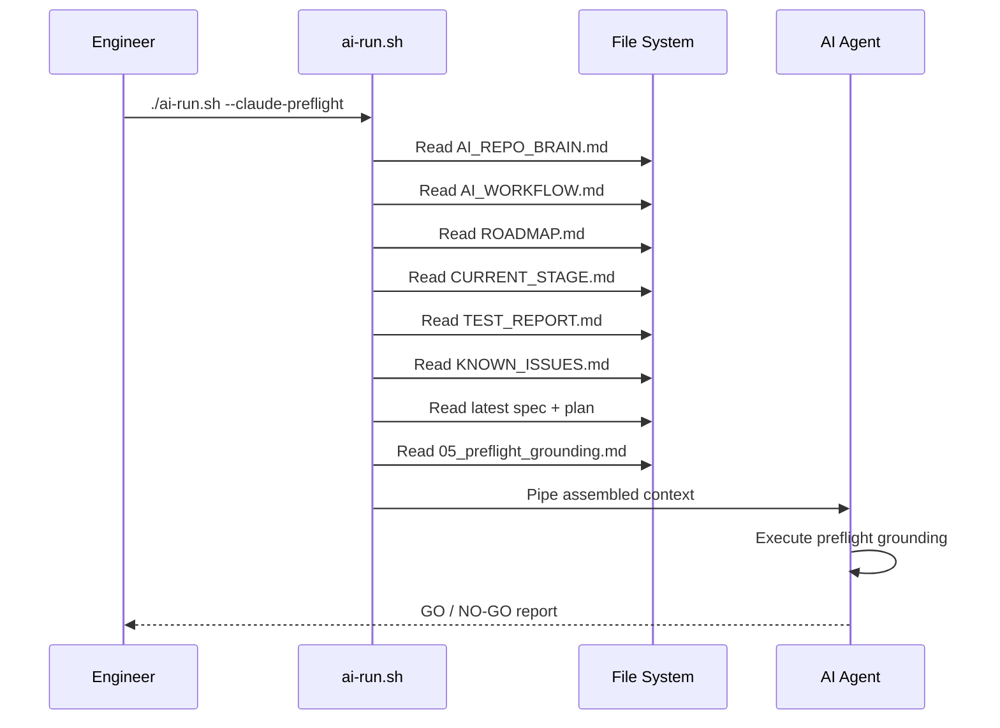

# AI Engineering Workflow — Diagrams

---

## 1. Feature Development Pipeline

End-to-end lifecycle of a feature from goal to merged PR.

---

## 2. AI Brain Architecture

How the AI Brain documents feed each agent in the workflow.

---

## 3. Multi-Agent Responsibility Model

How responsibilities are divided across agents.

---

## 4. AI Engineering Operating System

High-level view of the full system including context, tooling, and execution layers.

---

## 5. Preflight Grounding Decision Tree

How Claude decides GO or NO-GO during preflight.

---

## 6. CLI Context Bundle Flow

How `ai-run.sh` assembles and delivers context bundles.

